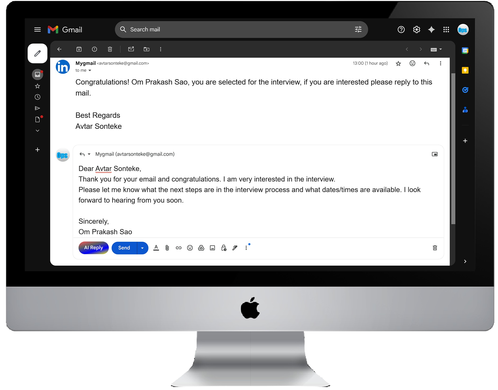

# 📬 Email Reply AI – Chrome Extension

A powerful Chrome extension that boosts email productivity by instantly generating professional, context-aware replies with just one click. It saves time, reduces effort, and helps users respond faster with clear, concise communication.

---

## 📸 Demo

  

## 🚀 Features

- 🧠 **AI-Powered Replies** – Automatically generates context-aware, polished email responses using Gemini API.
- ⚡ **One-Click Integration** – Just click the **"AI Reply"** button in your inbox to trigger a smart reply.
- ⏱️ **Real-Time Response** – Quick generation and insertion of replies directly into the email textbox.
- 🌐 **Seamless Extension Integration** – Easily integrates into any email platform via DOM manipulation.

---

## 🛠️ Tech Stack

**#JavaScript #ChromeExtension #SpringBoot #GeminiAPI #DOMManipulation #RESTAPI #HTML #CSS**

---

## 🧩 How It Works

1. The user clicks on the **"AI Reply"** button added to the email interface.
2. The extension reads the selected or visible email content from the DOM.
3. It sends the content to a **Spring Boot backend**, which formats it into a prompt.
4. The prompt is forwarded to the **Gemini API**, which generates a smart reply.
5. The generated reply is inserted directly into the email reply textbox.

---
## 🧠 Use Cases
- Professional email replies

- Interview or customer support responses

- Time-saving for high-volume inboxes

## 🔗 Connect with Me
### Om Prakash Sao
- **Final Year B.Tech CSE | Full Stack Java Developer**
- **📧 saoomprakash2002@gmail.com**
- **🌐 https://www.linkedin.com/in/om-prakash-sao-6bb039240/**

